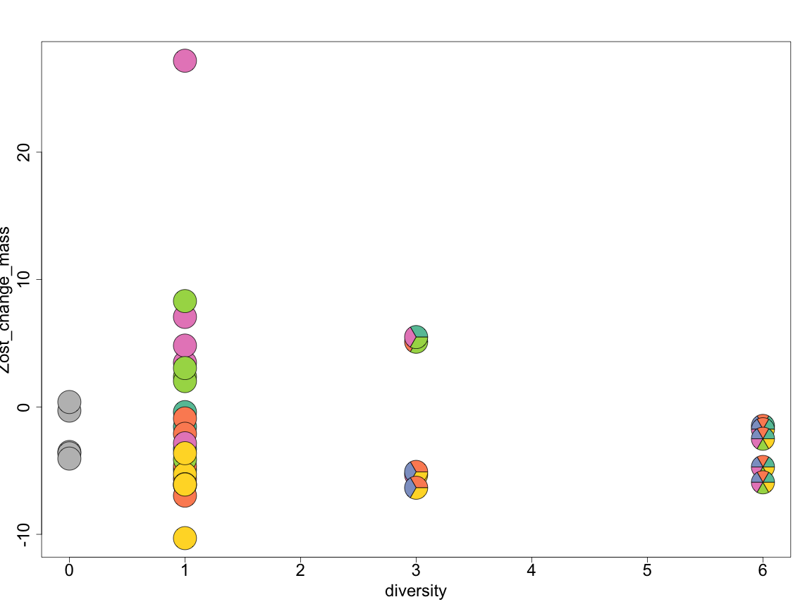
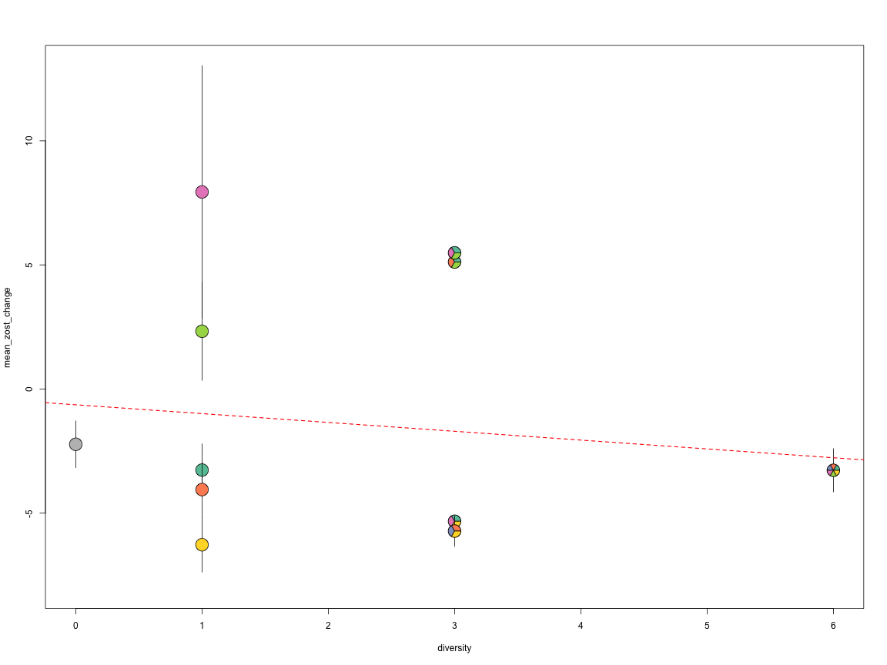

README for pieDivPlots
========================================================

A function for making plots where points are pie charts showing compositions. Code from work by Jillian Dunic wrapped into a function by Jarrett Byrnes.


```r
# first install the multifunc library to get the data for the example
library(devtools)
install_github(multifunc, "jebyrnes")

# now install some key packages if you don't have them already
install.packages("plotrix")
install.packages("RColorBrewer")
```


Here's an example using data from Duffy et al. 2003


```r
source("./pieDivPlot.R")
library(multifunc)
```

```
## Loading required package: plyr
```

```
## Loading required package: reshape2
```

```r
data(duffy_2003)

# which columns have species?
sp <- 18:23

# plot the raw data
pieDivPlot(diversity, Zost_change_mass, sp, data = duffy_2003, cex.axis = 2, 
    cex.lab = 2, radius = 0.1)
```



Or you can plot the data after aggregating it and show error bars.


```r

# plot the aggregated data with error
library(plyr)

duffy_2003_Zost <- ddply(duffy_2003, names(duffy_2003)[c(4:5, sp)], summarise, 
    mean_zost_change = mean(Zost_change_mass), se_zost_change = sd(Zost_change_mass)/sqrt(length(Zost_change_mass)))

# for treatments with only one replicate
duffy_2003_Zost$se_zost_change[which(is.na(duffy_2003_Zost$se_zost_change))] <- 0

pieDivPlot(diversity, mean_zost_change, 3:8, se_zost_change, data = duffy_2003_Zost, 
    ylim = c(-8, 13), cex.axis = 2, cex.lab = 2, radius = 0.1)

abline(lm(Zost_change_mass ~ diversity, data = duffy_2003), lwd = 1.5, lty = 2, 
    col = "red")
```




